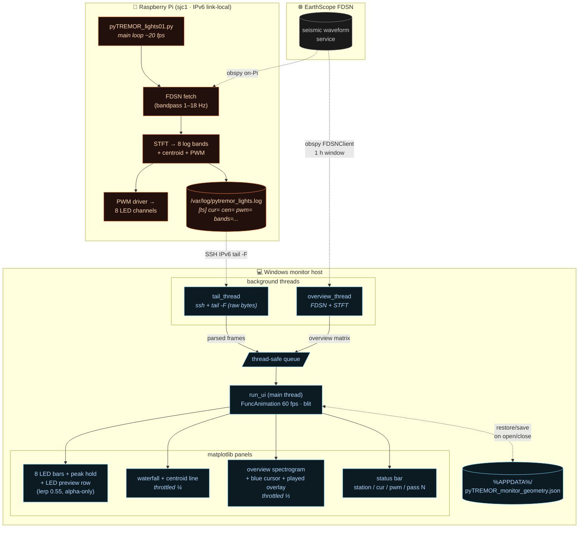

# pyTREMOR lights — system architecture

Open this file with VS Code's Markdown preview (`Ctrl+Shift+V`) to see the rendered diagram.



## Data flow

- **Raspberry Pi** independently does the actual work: pulls ~1 h of seismic
  data from EarthScope every cycle, runs STFT into 8 log-spaced bands
  (1–18 Hz), drives the LEDs via PWM, and prints one timestamped frame
  per replay step to `/var/log/pytremor_lights.log`.
- **Monitor host (Windows)** is purely observational. Three background
  threads feed one queue:
  - `tail_thread` — SSHes in over IPv6 link-local and streams the log
    byte-by-byte (raw `Popen(bufsize=0)`, splits on `\r`/`\n`).
  - `overview_thread` — downloads the same FDSN window locally with
    `obspy` and computes the big background spectrogram.
  - `pi_health_thread` — every 30 s runs one short SSH command on the
    Pi that bundles `vcgencmd`-free reads of
    `/sys/class/thermal/thermal_zone0/temp`, `hostname -I`,
    `systemctl is-active pytremor_lights`, `uptime -p`, `/proc/loadavg`,
    `free -m`, `df -h /`, and a 24 h error count from
    `journalctl -u pytremor_lights -p err`. Result is rendered as a
    small multi-line block in the top-right of the window (under the
    SSH destination), with colour cues: muted-grey when healthy,
    orange when there are errors in the last 24 h or CPU ≥ 70 °C, red
    when the service is not `active`, and “pi offline (ssh failed)” if
    the snapshot times out.
- **`run_ui`** drains the queue at 60 fps with `blit=True`. Only the LED
  preview row updates every frame; heavier panels (waterfall, overview,
  status text) have their data refreshed on a throttle but are always
  re-listed for blit so they never flicker.
- **Window geometry** persists across launches via JSON in `%APPDATA%`.
  Delete `%APPDATA%\pyTREMOR_monitor_geometry.json` if the window opens
  off-screen (e.g. after a monitor change).

## Launch

```powershell
$env:PATH += ";C:\Windows\System32\OpenSSH"
python 01_pyTREMOR_lights\pyTREMOR_lights_live_monitor.py
```

Requires system Python with `matplotlib`, `PySide6` (for QtAgg backend),
`numpy`, `scipy`, `obspy`. The repo `.venv` does **not** currently have
these — use the system interpreter at
`C:\Users\ubema\AppData\Local\Programs\Python\Python311\python.exe`.
